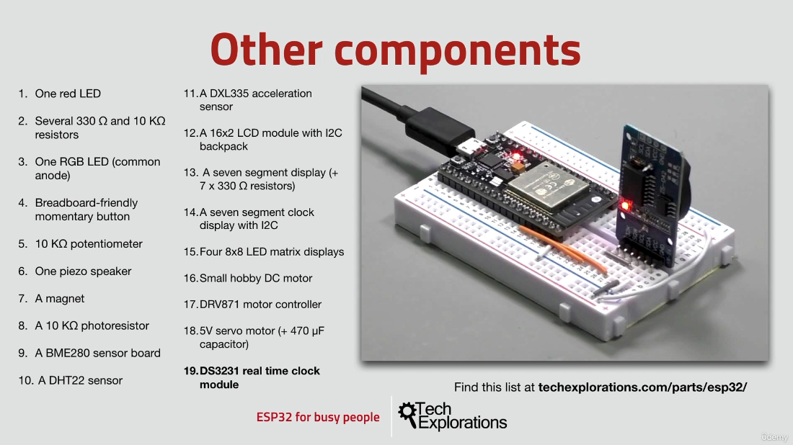
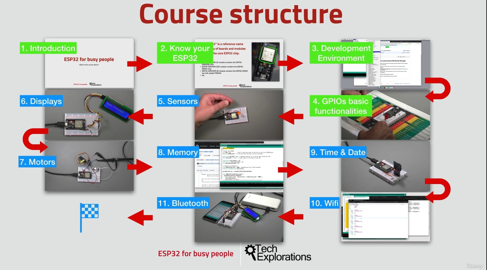

1.  [What is this course about?](#1)
2.  [Software you will need](#2)
3.  [Hardware you will need](#3)
4.  [How to get the most out of this course](#4)

---

### 1. What is this course about?

### 2. Software you will need

- Download Atom IDE [click me](https://github.blog/2022-06-08-sunsetting-atom/)
- Download RealTerm: Serial/TCP Terminal [click me](https://sourceforge.net/projects/realterm/)
- Download Arduino IDE [click me](https://www.arduino.cc/en/software)

### 3. Hardware you will need

- List of hardware(components) [click me](https://techexplorations.com/parts/esp32/)

### 4. How to get the most out of this course

- github, original repo [click me](https://github.com/joysmith/ESP32-For-Busy-People-1)
- ESP32 documentation [click me](https://docs.espressif.com/projects/esp-idf/en/latest/esp32/get-started/index.html)
