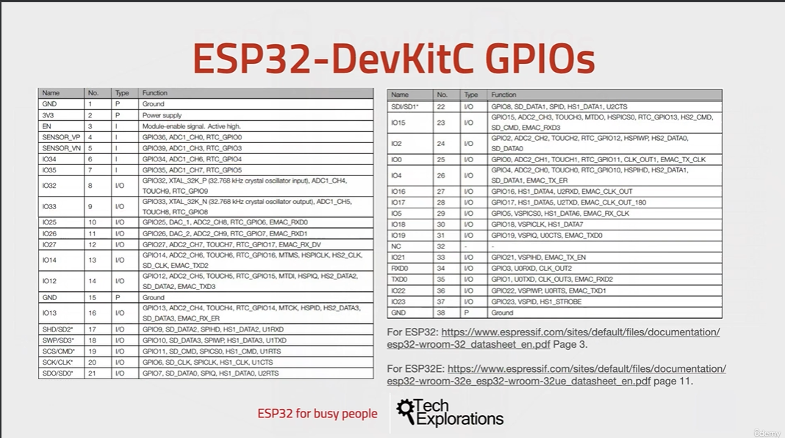
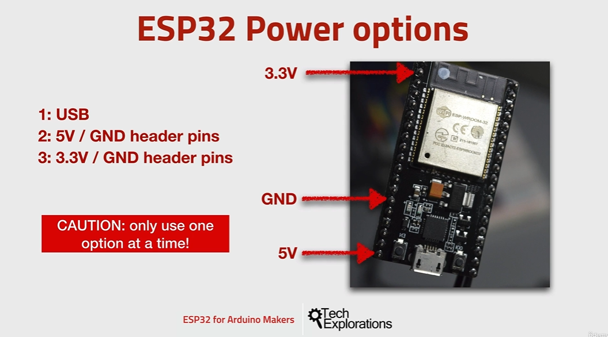

5. [The ESP32 module](#5)
6. [The ESP32 Dev Kit](#6)
7. [ESP32 vs Arduino](#7)
8. [GPIOs](#8)
9. [Communications](#9)
10. [Power](#10)

---

### 5. The ESP32 module

- Wiki topic, Pseudostatic RAM [click me](https://en.wikipedia.org/wiki/Dynamic_random-access_memory#PSRAM)
- Wiki topic, Inverted-F antenna [click me](https://en.wikipedia.org/wiki/Inverted-F_antenna)
- ESP32-S Series [click me](https://www.espressif.com/en/products/modules)
- Wiki topic, Pseudostatic RAM [click me](https://www.espressif.com/en/products/socs)

### 6. The ESP32 Dev Kit

- ESP32 development kit [click me](https://www.espressif.com/en/products/devkits)

### 7. ESP32 vs Arduino

### 8. GPIOs

- esp32 schematic [click me](https://dl.espressif.com/dl/schematics/esp32_devkitc_v4-sch-20180607a.pdf)
- ESP32­WROOM­32E, ESP32­WROOM­32UE Series Datasheet [click me](https://www.espressif.com/sites/default/files/documentation/esp32-wroom-32e_esp32-wroom-32ue_datasheet_en.pdf)
- esp32 GPIO Map [click me](https://d296hllh7cc607.cloudfront.net/esp32/resources/ESP32%20For%20Busy%20People%20-%202.040%20-%20The%20ESP32%20dev%20kit%20pin%20map.pdf)
- esp32 datasheet [click me](https://www.espressif.com/sites/default/files/documentation/esp32_datasheet_en.pdf)

### 9. Communications

- ESP32 Series Datasheet [click me](https://www.espressif.com/sites/default/files/documentation/esp32_datasheet_en.pdf)

- Wiki I²S topic [click me](https://en.wikipedia.org/wiki/I%C2%B2S)

### 10. Power

#### 3.3v does not have voltage regulator, so we have to regulate 3.3v external. else it will damage chip

- power supply [click me](https://docs.espressif.com/projects/esp-idf/en/latest/esp32/hw-reference/esp32/get-started-devkitc.html#power-supply-options)
