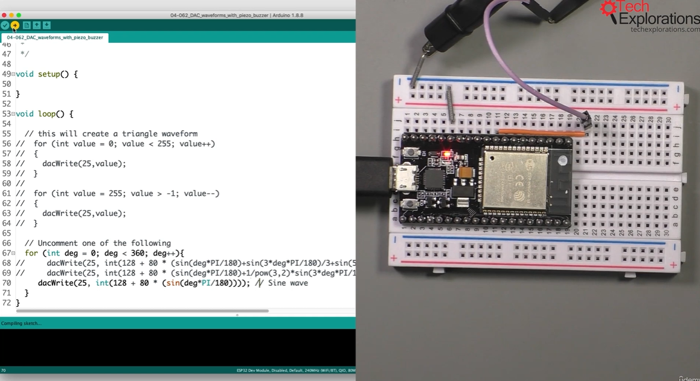
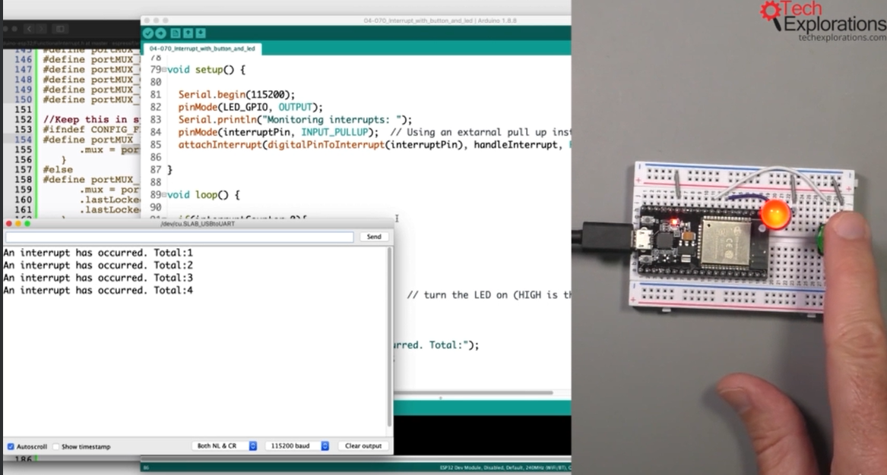

14. [Digital output LED](#14)
15. [PWM and LED](#15)
16. [RGB LED with PWM](#16)
17. [Digital input with Button](#17)
18. [Analog input with a potentiometer](#18)
19. [Analog input with potentiometer and PWM output](#19)
20. [An overview of Digital to Analog Conversion in the ESP32](#20)
21. [DAC demo sketch](#21)
22. [DAC analog waveform demo](#22)
23. [Making noise with the DAC](#23)
24. [GPIO interrupts, an introduction](#24)
25. [GPIO interrupts, sketch and demonstration](#25)

---

### 14. Digital output LED<a id="14"></a>


- Open arduino, go to file--> example--> basic--> Blink
- perform modification on sketch

```ino
/*  04.010 - ESP32 Digital out blink LED example
 *
 * This sketch shows you how to toggle the state of an LED using an ESP32.
 *
 * This sketch was written by Peter Dalmaris using information from the
 * ESP32 datasheet and examples.
 *
 *
 * Components
 * ----------
 *  - ESP32 Dev Kit v4
 *  - LED
 *  - 320 Ohm resistor
 *
 *  IDE
 *  ---
 *  Arduino IDE with ESP32 Arduino Code
 *  (https://github.com/espressif/arduino-esp32)
 *
 *
 *  Libraries
 *  ---------
 *  - None
 *  -
 *
 * Connections
 * -----------
 *
 *  ESP32 Dev Kit |     LED
 *  ------------------------------
 *        GND      |       Cathode
 *        GPIO32   |       Anode via resistor
 *
 *  It is possible to use any other GPIO that can be configured as an output.
 *  This excludes GPIO 34, 35, 36, 37, 38, 39.
 *
 *  Other information
 *  -----------------
 *
 *  1. ESP32 Datasheet: https://www.espressif.com/sites/default/files/documentation/esp32_datasheet_en.pdf
 *
 *  Created on March 14 2019 by Peter Dalmaris
 *
 */

// 1️⃣ set esp gpio pin no 32
const byte LED_GPIO = 32;

// the setup function runs once when you press reset or power the board
void setup() {
  // 2️⃣ initialize digital pin LED_GPIO as an output.
  pinMode(LED_GPIO, OUTPUT);
}

// the loop function runs over and over again forever
void loop() {
  digitalWrite(LED_GPIO, HIGH);   // turn the LED on (HIGH is the voltage level)
  delay(1000);                       // wait for a second
  digitalWrite(LED_GPIO, LOW);    // turn the LED off by making the voltage LOW
  delay(1000);                       // wait for a second
}
```

- Open arduino, go to Tools--> Board"...ESP Dev module"--> ESP32 Dev Module
- Open arduino, go to Tools--> Port"...USBtoUART"--?USBtoUART
- Press "Boot button" on node mcu to upload sketch

---

- ESP32­WROOM­32E, ESP32­WROOM­32UE Datasheet
  [click me](https://www.espressif.com/sites/default/files/documentation/esp32-wroom-32e_esp32-wroom-32ue_datasheet_en.pdf)

### 15. PWM and LED<a id="15"></a>

#### check pin no the author made mistake in diagram its the analog pin


- Open arduino, go to file--> example--> basic--> fade
- perform modification on sketch

```ino
/*  04.020 - ESP32 Digital out PWM LED example
 *
 * This sketch shows you how to use the PWM output capability of the ESP32.
 *
 * This sketch was written by Peter Dalmaris using information from the
 * ESP32 datasheet and examples.
 *
 *
 * Components
 * ----------
 *  - ESP32 Dev Kit v4
 *  - LED
 *  - 320 Ohm resistor
 *
 *  IDE
 *  ---
 *  Arduino IDE with ESP32 Arduino Code
 *  (https://github.com/espressif/arduino-esp32)
 *
 *
 *  Libraries
 *  ---------
 *  - None
 *  -
 *
 * Connections
 * -----------
 *
 *  ESP32 Dev Kit |     LED
 *  ------------------------------
 *        GND      |       Cathode
 *        GPIO32   |       Anode via resistor
 *
 *
 *
 *  It is possible to use any other PWM-capable GPIO.
 *
 *  Other information
 *  -----------------
 *
 *  1. ledc.h source code: https://github.com/espressif/arduino-esp32/blob/master/cores/esp32/esp32-hal-ledc.h
 *  2. ESP32 Datasheet: https://www.espressif.com/sites/default/files/documentation/esp32_datasheet_en.pdf
 *
 *  Created on March 14 2019 by Peter Dalmaris
 *
 */

// 1️⃣
const byte led_gpio = 32; // the PWM pin the LED is attached to
int brightness = 0;    // how bright the LED is
int fadeAmount = 1;    // how many points to fade the LED by

// the setup routine runs once when you press reset:
void setup() {
  // 2️⃣
  ledcAttachPin(led_gpio, 0); // assign a led pins to a channel

  // Initialize channels
  // channels 0-15, resolution 1-16 bits, freq limits depend on resolution
  // ledcSetup(uint8_t channel, uint32_t freq, uint8_t resolution_bits);
  // You can try different setup settings, such as:
  // ledcSetup(0, 4000, 8); // 4 kHz PWM, 8-bit resolution
  // If you make a change below, you will also need to change the "if" statement
  // around line 80 to reflect the correct number of steps for the selected resolution.
  // 3️⃣
  ledcSetup(0, 4000, 2); // 4 kHz PWM, 2-bit resolution


  //2^2 => 4
  // 2^3 => 8
  // 2^8 => 256
  // 2^12 => 4,096
}

// the loop routine runs over and over again forever:
void loop() {
  // 4️⃣
  ledcWrite(0, brightness); // set the brightness of the LED

  // change the brightness for next time through the loop:
  brightness = brightness + fadeAmount;

  // reverse the direction of the fading at the ends of the fade:
  if (brightness <= 0 || brightness >= 3) { // if you have selected 8 bits resolution, change 3 to 2^8 = 256
    fadeAmount = -fadeAmount;
  }
  // wait for 30 milliseconds to see the dimming effect
  delay(1000);
}
```

- ESP32 documentation LED Control (LEDC) [click me](https://docs.espressif.com/projects/arduino-esp32/en/latest/api/ledc.html)
- ESP32 Series Datasheet [click me](https://www.espressif.com/sites/default/files/documentation/esp32_datasheet_en.pdf)
- github "esp32-hal-ledc.h" [click me](https://github.com/espressif/arduino-esp32/blob/master/cores/esp32/esp32-hal-ledc.h)

note-

- The analogWrite() function is replaced with ledcWrite() write function

### 16. RGB LED with PWM<a id="16"></a>


- Open arduino, go to file--> example--> ESP32--> Analog output--> LEDwithRGB
- perform modification on sketch

```ino
/*  04.030 - ESP32 Digital out PWM RGB LED example
 *
 * This sketch shows you how to use the PWM output capability of the ESP32
 * to drive an RGB LED.
 *
 * The RGB LED in this example is common anode. You can use a common cathode
 * RGB LED by changing the "invert" variable to "false" and connecting the anodes
 * of the LED to the GPIOs instead of the GND pin.
 *
 * This sketch was written by Peter Dalmaris using information from the
 * ESP32 datasheet and examples.
 *
 *
 * Components
 * ----------
 *  - ESP32 Dev Kit v4
 *  - RGB LED, common anode
 *  - 320 Ohm resistor
 *
 *  IDE
 *  ---
 *  Arduino IDE with ESP32 Arduino Code
 *  (https://github.com/espressif/arduino-esp32)
 *
 *
 *  Libraries
 *  ---------
 *  - None
 *  -
 *
 * Connections
 * -----------
 *
 *  ESP32 Dev Kit |     LED
 *  ------------------------------
 *        GND      |       Anode
 *        GPIO32   |       Red pin via resistor
 *        GPIO33   |       Green pin via resistor
 *        GPIO25   |       Blue pin via resistor
 *
 *  It is possible to use any other PWM-capable GPIO.
 *
 *  Other information
 *  -----------------
 *
 *  1. ledc.h source code: https://github.com/espressif/arduino-esp32/blob/master/cores/esp32/esp32-hal-ledc.h
 *  2. ESP32 Datasheet: https://www.espressif.com/sites/default/files/documentation/esp32_datasheet_en.pdf
 *  3. The Arduino - ESP32 pin mapping is defined in:  https://github.com/espressif/arduino-esp32/blob/master/variants/esp32/pins_arduino.h
 *  4. Learn about Hue: https://en.wikipedia.org/wiki/Hue
 *
 *  Created on March 14 2019 by Peter Dalmaris
 *
 */

/*
  Original example: ledcWrite_RGB.ino
  Runs through the full 255 color spectrum for an rgb led
  Demonstrate ledcWrite functionality for driving leds with PWM on ESP32

  This example code is in the public domain.

  Some basic modifications were made by vseven, mostly commenting.
 */

// Set up the rgb led names

uint8_t ledR = A4;  // GPIO32
uint8_t ledG = A5;  // GPIO33
uint8_t ledB = A18; // GPIO25

const boolean invert = true; // set true if common anode, false if common cathode

uint8_t color = 0;          // a value from 0 to 255 representing the hue
uint32_t R, G, B;           // the Red Green and Blue color components
uint8_t brightness = 255;  // 255 is maximum brightness, but can be changed.  Might need 256 for common anode to fully turn off.

// the setup routine runs once when you press reset:
void setup()
{
  Serial.begin(115200);
  delay(10);

  ledcAttachPin(ledR, 1); // assign RGB led pins to channels
  ledcAttachPin(ledG, 2);
  ledcAttachPin(ledB, 3);

  // Initialize channels
  // channels 0-15, resolution 1-16 bits, freq limits depend on resolution
  // ledcSetup(uint8_t channel, uint32_t freq, uint8_t resolution_bits);
  ledcSetup(1, 12000, 8); // 12 kHz PWM, 8-bit resolution
  ledcSetup(2, 12000, 8);
  ledcSetup(3, 12000, 8);
}

// void loop runs over and over again
void loop()
{
  Serial.println("Send all LEDs a 255 and wait 2 seconds.");
  // If your RGB LED turns off instead of on here you should check if the LED is common anode or cathode.
  // If it doesn't fully turn off and is common anode try using 256.
  ledcWrite(1, 255);
  ledcWrite(2, 255);
  ledcWrite(3, 255);
  delay(2000);
  Serial.println("Send all LEDs a 0 and wait 2 seconds.");
  ledcWrite(1, 0);
  ledcWrite(2, 0);
  ledcWrite(3, 0);
  delay(2000);

  Serial.println("Starting color fade loop.");

 for (color = 0; color < 255; color++) { // Slew through the color spectrum

  hueToRGB(color, brightness);  // call function to convert hue to RGB

  // write the RGB values to the pins
  ledcWrite(1, R); // write red component to channel 1, etc.
  ledcWrite(2, G);
  ledcWrite(3, B);

  delay(100); // full cycle of rgb over 256 colors takes 26 seconds
 }

}

// Courtesy http://www.instructables.com/id/How-to-Use-an-RGB-LED/?ALLSTEPS
// function to convert a color to its Red, Green, and Blue components.

void hueToRGB(uint8_t hue, uint8_t brightness)
{
    uint16_t scaledHue = (hue * 6);
    uint8_t segment = scaledHue / 256; // segment 0 to 5 around the
                                            // color wheel
    uint16_t segmentOffset =
      scaledHue - (segment * 256); // position within the segment

    uint8_t complement = 0;
    uint16_t prev = (brightness * ( 255 -  segmentOffset)) / 256;
    uint16_t next = (brightness *  segmentOffset) / 256;

    if(invert)
    {
      brightness = 255 - brightness;
      complement = 255;
      prev = 255 - prev;
      next = 255 - next;
    }

    switch(segment ) {
    case 0:      // red
        R = brightness;
        G = next;
        B = complement;
    break;
    case 1:     // yellow
        R = prev;
        G = brightness;
        B = complement;
    break;
    case 2:     // green
        R = complement;
        G = brightness;
        B = next;
    break;
    case 3:    // cyan
        R = complement;
        G = prev;
        B = brightness;
    break;
    case 4:    // blue
        R = next;
        G = complement;
        B = brightness;
    break;
   case 5:      // magenta
    default:
        R = brightness;
        G = complement;
        B = prev;
    break;
    }
}
```

- Wiki Hue topic [click me](https://en.wikipedia.org/wiki/Hue)
- github "pins_arduino.h", mapping arduino pin to ESP32 [click me](https://github.com/espressif/arduino-esp32/blob/master/variants/esp32/pins_arduino.h)

#### WHere to find pins_arduino.h file in windows

```sh
C:\Users\11988\AppData\Local\Arduino15\packages\esp32\hardware\esp32\3.0.0-rc3\variants\XIAO_ESP32C3\pins_arduino.h
```

### 17. Digital input with Button<a id="17"></a>


```ino
/*  04.040 - ESP32 Digital input with button example

   This sketch shows you how to read the state of a button using an ESP32.

   When the button is pressed, the LED turns on.

   When the button is depressed, the LED turns off.

   This sketch was written by Peter Dalmaris using information from the
   ESP32 datasheet and examples.


   Components
   ----------
    - ESP32 Dev Kit v4
    - LED
    - 320 Ohm resistor
    - Button
    - 10 KOhm resistor

    IDE
    ---
    Arduino IDE with ESP32 Arduino Code
    (https://github.com/espressif/arduino-esp32)


    Libraries
    ---------
    - None
    -

   Connections
   -----------

    Refer to wiring diagram for a visual wiring guide

    ESP32 Dev Kit |     Component
    ------------------------------
          GND      |    LED Cathode
          GPIO32   |    LED Anode via 320 Ohm resistor
          GPIO36   |    Button read pin, plus 10 KOhm pull-down resistor to GND
          GND      |    Button GND pin


    It is possible to use any other GPIO that can be configured as an output or input.
    This excludes GPIO 34, 35, 36, 37, 38, 39 (these only work as inputs).

    Other information
    -----------------

    1. ESP32 Datasheet: https://www.espressif.com/sites/default/files/documentation/esp32_datasheet_en.pdf

    Created on March 26 2019 by Peter Dalmaris

*/


const byte LED_GPIO = 32;
const byte BUTTON_GPIO = 36;

// variables will change:
int buttonState = 0;         // variable for reading the pushbutton status

// the setup function runs once when you press reset or power the board
void setup() {
  // initialize digital pin LED_GPIO as an output.
  pinMode(LED_GPIO, OUTPUT);

  // initialize the pushbutton pin as an input:
  pinMode(BUTTON_GPIO, INPUT);
}

// the loop function runs over and over again forever
void loop() {
  // read the state of the pushbutton value:
  buttonState = digitalRead(BUTTON_GPIO);

  // check if the pushbutton is pressed. If it is, the buttonState is HIGH:
  if (buttonState == HIGH) {
    // turn LED on:
    digitalWrite(LED_GPIO, HIGH);
  } else {
    // turn LED off:
    digitalWrite(LED_GPIO, LOW);
  }
}
```

Note-

- Push button, pin connected to pull-down resistor which is connected to ground
- Push button---pulldown resistor---ground

### 18. Analog input with a potentiometer<a id="18"></a>


#### Output


```ino
/*  04.050 - ESP32 Analog input with potentiometer

   This sketch shows you how to read the state of a potentiometer using an ESP32.

   As you turn the potentiometer knob, see the measured value in the serial monitor.

   This sketch was written by Peter Dalmaris using information from the
   ESP32 datasheet and examples.


   Components
   ----------
    - ESP32 Dev Kit v4
    - 10 KOhm potentiometer

    IDE
    ---
    Arduino IDE with ESP32 Arduino Code
    (https://github.com/espressif/arduino-esp32)


    Libraries
    ---------
    - None
    -

   Connections
   -----------

    Refer to wiring diagram for a visual wiring guide

    ESP32 Dev Kit |     Potentiometer
    ------------------------------
          GND      |    Pin 1
          GPIO36   |    Pin 2 (middle)
          GND      |    Pin 3


    Other information
    -----------------

    1. ESP32 Datasheet: https://www.espressif.com/sites/default/files/documentation/esp32_datasheet_en.pdf
    2. Espressif Docs: https://docs.espressif.com/projects/esp-idf/en/latest/api-reference/peripherals/adc.html#configuration-and-reading-adc

    Created on March 26 2019 by Peter Dalmaris

*/

const byte POT_GPIO = 36;

// the setup routine runs once when you press reset:
void setup() {
  // initialize serial communication at 9600 bits per second:
  Serial.begin(9600);
}

// the loop routine runs over and over again forever:
void loop() {
  // print out the value you read:
  Serial.println(analogRead(POT_GPIO));
}
```

- ESP32 Documentation ADC [click me](https://docs.espressif.com/projects/esp-idf/en/latest/esp32/api-reference/peripherals/index.html)

### 19. Analog input with potentiometer and PWM output<a id="19"></a>


```ino
/*  04.060 - Sigma Delta modulation with potentiometer example
 *
 * This sketch shows you how to create a sigma-delta modulated analog output using a potentiometer.
 *
 * Connect your LED to GPIO 25.
 *
 * Run the sketch.
 *
 * Turn the knob of the potentiometer, and see how the intensity of the LED changes.
 *
 *
 * This sketch was written by Peter Dalmaris using information from the
 * ESP32 datasheet and examples.
 *
 *
 * Components
 * ----------
 *  - ESP32 Dev Kit v4
 *  - Potentiometer, 10 KOhm
 *  - LED with a 330 Ohm resistor
 *
 *  IDE
 *  ---
 *  Arduino IDE with ESP32 Arduino Code
 *  (https://github.com/espressif/arduino-esp32)
 *
 *
 *  Libraries
 *  ---------
 *  - None
 *  -
 *
 * Connections
 * -----------
 *
 *  Potentiometer: Pin 1 to 3.3V, Pin 2 to GPIO36, Pin 3 to GND
 *  LED: Anode to GPIO32, cathode to 330 Ohm resistor, resistor to GND
 *
 *  Other information
 *  -----------------
 *
 *  1. ESP32 Datasheet: https://www.espressif.com/sites/default/files/documentation/esp32_datasheet_en.pdf
 *  2. Learn about Sigma Delta modulation: https://en.wikipedia.org/wiki/Delta-sigma_modulation
 *  3. Sigma Delta modulation in the ESP32 (Docs): https://docs.espressif.com/projects/esp-idf/en/latest/api-reference/peripherals/sigmadelta.html?highlight=sigmaDelta
 *  4. Wikibooks: https://en.wikibooks.org/wiki/Digital_Signal_Processing/Sigma-Delta_modulation
 *  5. Electronic Design: https://www.electronicdesign.com/analog/understanding-delta-sigma-modulators
 *  6. Sigma-delta header file: https://github.com/espressif/arduino-esp32/blob/master/cores/esp32/esp32-hal-sigmadelta.h
 *
 *  Created on March 26 2019 by Peter Dalmaris
 *
 */

const byte POT_GPIO = 36;
const byte LED_GPIO = 25;

void setup()
{
    //setup channel 0 with frequency 312500 Hz
    sigmaDeltaSetup(LED_GPIO, 0, 312500);
    //attach pin 32 to channel 0
    //sigmaDeltaAttachPin(LED_GPIO,0);  // No longer used in newer versions of the Espressif libraries
    //initialize channel 0 to off
    sigmaDeltaWrite(0, 0);
}

void loop()
{
    int pot_value = analogRead(POT_GPIO);
    sigmaDeltaWrite(0, map(pot_value, 0, 4095, 0, 255));
    delay(10);
}
```

### 20. An overview of Digital to Analog Conversion in the ESP32<a id="20"></a>


- ESP32 Documentation Digital To Analog Converter (DAC) [click me](https://docs.espressif.com/projects/esp-idf/en/latest/esp32/api-reference/peripherals/dac.html)
- ESP32 Datasheet [click me](https://www.espressif.com/sites/default/files/documentation/esp32_technical_reference_manual_en.pdf)

### 21. DAC demo sketch<a id="21"></a>


```ino
/*  04.062 - Digital to Analog (DAC) waveforms with piezo buzzer
 *
 * This sketch shows you how to create sounds from various waveforms and a piezo buzzer.
 *
 * Connect your buzzer to GPIO 25 (DAC 1).
 *
 * Uncomment the waveform you want to listen to.
 *
 * Run the sketch.
 *
 * Listen to the waveform as it is converted to sound by the buzzer.
 *
 * This sketch was written by Peter Dalmaris using information from the
 * ESP32 datasheet and examples.
 *
 *
 * Components
 * ----------
 *  - ESP32 Dev Kit v4
 *  - Piezo buzzer
 *
 *  IDE
 *  ---
 *  Arduino IDE with ESP32 Arduino Code
 *  (https://github.com/espressif/arduino-esp32)
 *
 *
 *  Libraries
 *  ---------
 *  - None
 *  -
 *
 * Connections
 * -----------
 *
 *  Buzzer: Connect on pin to DAC 1 and the other to GND.
 *
 *  Other information
 *  -----------------
 *
 *  1. ESP32 Datasheet: https://www.espressif.com/sites/default/files/documentation/esp32_datasheet_en.pdf
 *  2. ESP32 has two 8-bit DAC (digital to analog converter) channels, connected to GPIO25 (Channel 1) and GPIO26 (Channel 2)
 *  3. ESP32 Arduino Core header file: https://github.com/espressif/arduino-esp32/blob/master/cores/esp32/esp32-hal-dac.h
 *
 *  Created on March 26 2019 by Peter Dalmaris
 *
 */

void setup() {

}

void loop() {

  // this will create a triangle waveform
  for (int value = 0; value < 255; value=value+5)
  {
    dacWrite(25,value);
  }

  for (int value = 255; value > -1; value=value-5)
  {
    dacWrite(25,value);
  }

  // Uncomment one of the following
 // for (int deg = 0; deg < 360; deg++){
 //    dacWrite(25, int(128 + 80 * (sin(deg*PI/180)+sin(3*deg*PI/180)/3+sin(5*deg*PI/180)/5+sin(7*deg*PI/180)/7+sin(9*deg*PI/180)/9+sin(11*deg*PI/180)/11))); // Square
 //    dacWrite(25, int(128 + 80 * (sin(deg*PI/180)+1/pow(3,2)*sin(3*deg*PI/180)+1/pow(5,2)*sin(5*deg*PI/180)+1/pow(7,2)*sin(7*deg*PI/180)+1/pow(9,2)*sin(9*deg*PI/180))));  // Triangle
 //    dacWrite(25, int(128 + 80 * (sin(deg*PI/180)))); // Sine wave
 // }
}
```

- Sine Look Up Table Generator Calculator [click me](https://www.daycounter.com/Calculators/Sine-Generator-Calculator.phtml)
- Triangle Wave Look Up Table Generator Calculator [click me](https://www.daycounter.com/Calculators/Triangle-Wave-Generator-Calculator.phtml)
- github, futureshocked [click me](https://github.com/futureshocked/aabt/tree/master/zero_waveform_dac)

### 22. DAC analog waveform demo<a id="22"></a>


```ino
/*  04.062 - Digital to Analog (DAC) waveforms with piezo buzzer
 *
 * This sketch shows you how to create sounds from various waveforms and a piezo buzzer.
 *
 * Connect your buzzer to GPIO 25 (DAC 1).
 *
 * Uncomment the waveform you want to listen to.
 *
 * Run the sketch.
 *
 * Listen to the waveform as it is converted to sound by the buzzer.
 *
 * This sketch was written by Peter Dalmaris using information from the
 * ESP32 datasheet and examples.
 *
 *
 * Components
 * ----------
 *  - ESP32 Dev Kit v4
 *  - Piezo buzzer
 *
 *  IDE
 *  ---
 *  Arduino IDE with ESP32 Arduino Code
 *  (https://github.com/espressif/arduino-esp32)
 *
 *
 *  Libraries
 *  ---------
 *  - None
 *  -
 *
 * Connections
 * -----------
 *
 *  Buzzer: Connect on pin to DAC 1 and the other to GND.
 *
 *  Other information
 *  -----------------
 *
 *  1. ESP32 Datasheet: https://www.espressif.com/sites/default/files/documentation/esp32_datasheet_en.pdf
 *  2. ESP32 has two 8-bit DAC (digital to analog converter) channels, connected to GPIO25 (Channel 1) and GPIO26 (Channel 2)
 *  3. ESP32 Arduino Core header file: https://github.com/espressif/arduino-esp32/blob/master/cores/esp32/esp32-hal-dac.h
 *
 *  Created on March 26 2019 by Peter Dalmaris
 *
 */

void setup() {

}

void loop() {

  // this will create a triangle waveform
  for (int value = 0; value < 255; value=value+5)
  {
    dacWrite(25,value);
  }

  for (int value = 255; value > -1; value=value-5)
  {
    dacWrite(25,value);
  }

  // Uncomment one of the following
 // for (int deg = 0; deg < 360; deg++){
 //    dacWrite(25, int(128 + 80 * (sin(deg*PI/180)+sin(3*deg*PI/180)/3+sin(5*deg*PI/180)/5+sin(7*deg*PI/180)/7+sin(9*deg*PI/180)/9+sin(11*deg*PI/180)/11))); // Square
 //    dacWrite(25, int(128 + 80 * (sin(deg*PI/180)+1/pow(3,2)*sin(3*deg*PI/180)+1/pow(5,2)*sin(5*deg*PI/180)+1/pow(7,2)*sin(7*deg*PI/180)+1/pow(9,2)*sin(9*deg*PI/180))));  // Triangle
 //    dacWrite(25, int(128 + 80 * (sin(deg*PI/180)))); // Sine wave
 // }
}
```

- github, dacWrite() function in header file[click me](https://github.com/espressif/arduino-esp32/blob/master/cores/esp32/esp32-hal-dac.h)

---

#### Generating waveform using trignometic function




```ino
/*  04.062 - Digital to Analog (DAC) waveforms with piezo buzzer
 *
 * This sketch shows you how to create sounds from various waveforms and a piezo buzzer.
 *
 * Connect your buzzer to GPIO 25 (DAC 1).
 *
 * Uncomment the waveform you want to listen to.
 *
 * Run the sketch.
 *
 * Listen to the waveform as it is converted to sound by the buzzer.
 *
 * This sketch was written by Peter Dalmaris using information from the
 * ESP32 datasheet and examples.
 *
 *
 * Components
 * ----------
 *  - ESP32 Dev Kit v4
 *  - Piezo buzzer
 *
 *  IDE
 *  ---
 *  Arduino IDE with ESP32 Arduino Code
 *  (https://github.com/espressif/arduino-esp32)
 *
 *
 *  Libraries
 *  ---------
 *  - None
 *  -
 *
 * Connections
 * -----------
 *
 *  Buzzer: Connect on pin to DAC 1 and the other to GND.
 *
 *  Other information
 *  -----------------
 *
 *  1. ESP32 Datasheet: https://www.espressif.com/sites/default/files/documentation/esp32_datasheet_en.pdf
 *  2. ESP32 has two 8-bit DAC (digital to analog converter) channels, connected to GPIO25 (Channel 1) and GPIO26 (Channel 2)
 *  3. ESP32 Arduino Core header file: https://github.com/espressif/arduino-esp32/blob/master/cores/esp32/esp32-hal-dac.h
 *
 *  Created on March 26 2019 by Peter Dalmaris
 *
 */

void setup() {

}

void loop() {


  // Uncomment one of the following
 // for (int deg = 0; deg < 360; deg++){
 //    dacWrite(25, int(128 + 80 * (sin(deg*PI/180)+sin(3*deg*PI/180)/3+sin(5*deg*PI/180)/5+sin(7*deg*PI/180)/7+sin(9*deg*PI/180)/9+sin(11*deg*PI/180)/11))); // Square

 //    dacWrite(25, int(128 + 80 * (sin(deg*PI/180)+1/pow(3,2)*sin(3*deg*PI/180)+1/pow(5,2)*sin(5*deg*PI/180)+1/pow(7,2)*sin(7*deg*PI/180)+1/pow(9,2)*sin(9*deg*PI/180))));  // Triangle

     dacWrite(25, int(128 + 80 * (sin(deg*PI/180)))); // Sine wave
  }
}
```

---


---


### 23. Making noise with the DAC<a id="23"></a>


```ino
/*  04.062 - Digital to Analog (DAC) waveforms with piezo buzzer
 *
 * This sketch shows you how to create sounds from various waveforms and a piezo buzzer.
 *
 * Connect your buzzer to GPIO 25 (DAC 1).
 *
 * Uncomment the waveform you want to listen to.
 *
 * Run the sketch.
 *
 * Listen to the waveform as it is converted to sound by the buzzer.
 *
 * This sketch was written by Peter Dalmaris using information from the
 * ESP32 datasheet and examples.
 *
 *
 * Components
 * ----------
 *  - ESP32 Dev Kit v4
 *  - Piezo buzzer
 *
 *  IDE
 *  ---
 *  Arduino IDE with ESP32 Arduino Code
 *  (https://github.com/espressif/arduino-esp32)
 *
 *
 *  Libraries
 *  ---------
 *  - None
 *  -
 *
 * Connections
 * -----------
 *
 *  Buzzer: Connect on pin to DAC 1 and the other to GND.
 *
 *  Other information
 *  -----------------
 *
 *  1. ESP32 Datasheet: https://www.espressif.com/sites/default/files/documentation/esp32_datasheet_en.pdf
 *  2. ESP32 has two 8-bit DAC (digital to analog converter) channels, connected to GPIO25 (Channel 1) and GPIO26 (Channel 2)
 *  3. ESP32 Arduino Core header file: https://github.com/espressif/arduino-esp32/blob/master/cores/esp32/esp32-hal-dac.h
 *
 *  Created on March 26 2019 by Peter Dalmaris
 *
 */

void setup() {

}

void loop() {

  // this will create a triangle waveform
  for (int value = 0; value < 255; value=value+5)
  {
    dacWrite(25,value);
  }

  for (int value = 255; value > -1; value=value-5)
  {
    dacWrite(25,value);
  }

  // Uncomment one of the following
 // for (int deg = 0; deg < 360; deg++){
 //    dacWrite(25, int(128 + 80 * (sin(deg*PI/180)+sin(3*deg*PI/180)/3+sin(5*deg*PI/180)/5+sin(7*deg*PI/180)/7+sin(9*deg*PI/180)/9+sin(11*deg*PI/180)/11))); // Square
 //    dacWrite(25, int(128 + 80 * (sin(deg*PI/180)+1/pow(3,2)*sin(3*deg*PI/180)+1/pow(5,2)*sin(5*deg*PI/180)+1/pow(7,2)*sin(7*deg*PI/180)+1/pow(9,2)*sin(9*deg*PI/180))));  // Triangle
 //    dacWrite(25, int(128 + 80 * (sin(deg*PI/180)))); // Sine wave
 // }
}
```

- uncomment and comment trignometic function to hear different harmonic

Notice-

- The digital syntheizer, yamaha keyboard all digital microcontroller board make harmonic sound basically they all are programmed trignometic functions

### 24. GPIO interrupts, an introduction<a id="24"></a>

- ESP32 Documentation Interrupt Allocation[click me](https://docs.espressif.com/projects/esp-idf/en/latest/esp32/api-reference/system/intr_alloc.html)
- ESP32 Datasheet [click me](https://www.espressif.com/sites/default/files/documentation/esp32_technical_reference_manual_en.pdf)

### 25. GPIO interrupts, sketch and demonstration<a id="25"></a>




```ino
/*  04.070 - GPIO interrupt with button and LED
 *
 * This sketch shows you how to use an interrupt routine to respond to a
 * button press.
 *
 * When the button is pressed, the LED state toggles.
 *
 * This example includes software debouncing code.
 *
 * This sketch was written by Peter Dalmaris using information from the
 * ESP32 datasheet and examples.
 *
 *
 * Components
 * ----------
 *  - ESP32 Dev Kit v4
 *  - LED
 *  - 320 Ohm resistor
 *  - Button (using an internal pull-up resistor)
 *
 *  IDE
 *  ---
 *  Arduino IDE with ESP32 Arduino Code
 *  (https://github.com/espressif/arduino-esp32)
 *
 *
 *  Libraries
 *  ---------
 *  - None
 *  -
 *
 * Connections
 * -----------
 *
 *  ESP32 Dev Kit |     LED
 *  ------------------------------
 *        GND      |    Cathode
 *        GPIO32   |    Anode via resistor
 *
 *  Connect pin 1 of the button to ESP32 GPIO 25.
 *  Connect pin 2 of the button to ESP32 GND.
 *
 *  It is possible to use any other GPIO that can be configured as an output.
 *  This excludes GPIO 34, 35, 36, 37, 38, 39.
 *
 *  Other information
 *  -----------------
 *
 *  1. ESP32 Datasheet: https://www.espressif.com/sites/default/files/documentation/esp32_datasheet_en.pdf
 *  2. Interrupt allocations (Doc): https://docs.espressif.com/projects/esp-idf/en/latest/api-reference/system/intr_alloc.html
 *  3. Technical reference (2. Interrupt Matrix): https://www.espressif.com/sites/default/files/documentation/esp32_technical_reference_manual_en.pdf
 *  4. ESP32-IDF portmacro.h: http://esp32.info/docs/esp_idf/html/dc/d35/portmacro_8h_source.html
 *  Created on March 26 2019 by Peter Dalmaris
 *
 */

const byte LED_GPIO = 32;  // Marked volatile so it can be read inside the ISR
bool led_state = false;  // Keep track of the state of the LED

const byte interruptPin = 25;
volatile int interruptCounter = 0;
int numberOfInterrupts = 0;

// Debouncing parameters
long debouncing_time = 1000; //Debouncing Time in Milliseconds
volatile unsigned long last_micros;

portMUX_TYPE mux = portMUX_INITIALIZER_UNLOCKED;

void IRAM_ATTR handleInterrupt() {
  portENTER_CRITICAL_ISR(&mux);
   if((long)(micros() - last_micros) >= debouncing_time * 1000) {
    interruptCounter++;
  }
  last_micros = micros();
  portEXIT_CRITICAL_ISR(&mux);
}

void setup() {

  Serial.begin(115200);
  pinMode(LED_GPIO, OUTPUT);
  Serial.println("Monitoring interrupts: ");
  pinMode(interruptPin, INPUT_PULLUP);  // Using an extarnal pull up instead of internal
  attachInterrupt(digitalPinToInterrupt(interruptPin), handleInterrupt, FALLING);

}

void loop() {

  if(interruptCounter>0){

      portENTER_CRITICAL(&mux);
      interruptCounter--;
      portEXIT_CRITICAL(&mux);

      led_state = !led_state;

      digitalWrite(LED_GPIO, led_state);   // turn the LED on (HIGH is the voltage level)

      numberOfInterrupts++;
      Serial.print("An interrupt has occurred. Total:");
      Serial.println(numberOfInterrupts);
  }
}
```

- github, FunctionalInterrupt.h[click me](https://github.com/espressif/arduino-esp32/blob/master/cores/esp32/FunctionalInterrupt.h)
- github, portmacro.h [click me](https://github.com/espressif/esp-idf/blob/f586f5e690e687f8db219a8b509bbf483fc416d6/components/freertos/include/freertos/portmacro.h)
