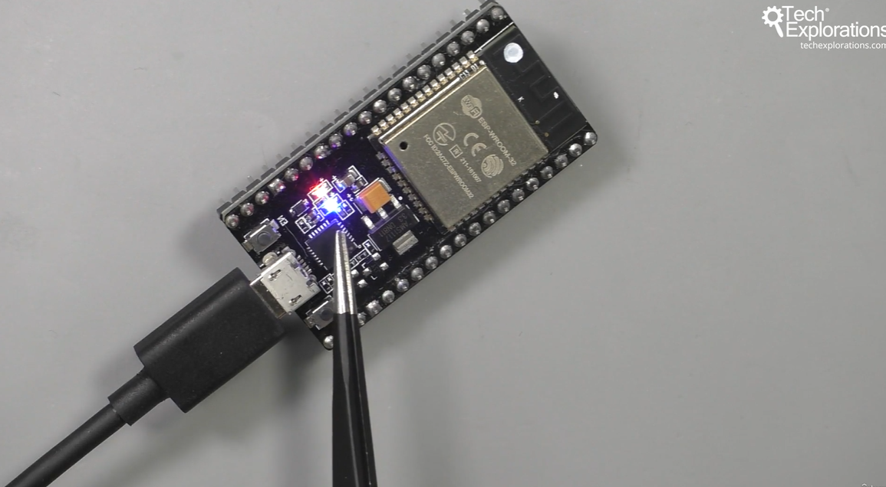

46. [Wifi connection](#46)
47. [Wifi HTTP client](#47)
48. [Wifi HTTPS client](#48)
49. [Wifi HTTPS client LED control](#49)

---

### 46. Wifi connection<a id="46"></a>


- Open arduino, go to file--> example--> wifi--> WiFi access point

#### How to get more information on serial monitor

- Open arduino, go to tools--> Core debug level"Debug"--> debug

```ino
/*  10.010 - Connection to a Wifi network

   This sketch simply connects the ESP32 to a Wifi network.

   Once the connection is made, nothing else happens.

   This sketch was written by Peter Dalmaris using information from the
   ESP32 datasheet and examples.


   Components
   ----------
    - ESP32 Dev Kit v4

    IDE
    ---
    Arduino IDE with ESP32 Arduino Code
    (https://github.com/espressif/arduino-esp32)


    Libraries
    ---------
    - WiFi (comes with the ESP32 Arduino core)


   Connections
   -----------

    No connections needed, the ESP32 is the only hardware.


    Other information
    -----------------

    1. ESP32 Datasheet: https://www.espressif.com/sites/default/files/documentation/esp32_datasheet_en.pdf
    2. Wifi library: https://github.com/espressif/arduino-esp32/tree/master/libraries/WiFi

    Created on April 8 2019 by Peter Dalmaris

*/

#include <WiFi.h>

const char* ssid     = "ardwifi";     // change this for your own network
const char* password = "ardwifi987";  // change this for your own network

void setup()
{
  Serial.begin(115200);
  delay(10);

  // We start by connecting to a WiFi network

  Serial.println();
  Serial.println();
  Serial.print("Connecting to ");
  Serial.println(ssid);

  WiFi.begin(ssid, password);

  while (WiFi.status() != WL_CONNECTED) {
    delay(500);
    Serial.print(".");
  }

  Serial.println("");
  Serial.println("WiFi connected");
  Serial.println("IP address: ");
  Serial.println(WiFi.localIP());
}

void loop()
{

}
```

- github, WiFi [click me](https://github.com/espressif/arduino-esp32/tree/master/libraries/WiFi)

### 47. Wifi HTTP client<a id="47"></a>


- Create a file.txt write some text in it. upload to S3 bucket, or github

```ino
/*  10.020 - Simple HTTP client

   This sketch receives data via HTTP GET requests to fetch a text file from a web server.

   To try it our, either use it as-is (in which case, your ESP32 will retrieve the text in my
   sample text file), or upload a text file in your own web server and change the host and url strings.

   This sketch was written by Peter Dalmaris using information from the
   ESP32 datasheet and examples.


   Components
   ----------
    - ESP32 Dev Kit v4

    IDE
    ---
    Arduino IDE with ESP32 Arduino Code
    (https://github.com/espressif/arduino-esp32)


    Libraries
    ---------
    - WiFi (comes with the ESP32 Arduino core)


   Connections
   -----------

    No connections needed, the ESP32 is the only hardware.


    Other information
    -----------------

    1. ESP32 Datasheet: https://www.espressif.com/sites/default/files/documentation/esp32_datasheet_en.pdf
    2. Wifi library: https://github.com/espressif/arduino-esp32/tree/master/libraries/WiFi
    3. The remote text file is at: https://txplore-downloads.s3.amazonaws.com/esp32/test_file.txt

    Created on April 8 2019 by Peter Dalmaris

*/

#include <WiFi.h>

const char* ssid     = "ardwifi";     // change this for your own network
const char* password = "ardwifi987";  // change this for your own network

const char* host = "txplore-downloads.s3.amazonaws.com";  // Change this for your own server
String url = "/esp32/test_file.txt";                      // Change this for your own file

void setup()
{
    Serial.begin(115200);
    delay(10);

    // We start by connecting to a WiFi network

    Serial.println();
    Serial.println();
    Serial.print("Connecting to ");
    Serial.println(ssid);

    WiFi.begin(ssid, password);

    while (WiFi.status() != WL_CONNECTED) {
        delay(500);
        Serial.print(".");
    }

    Serial.println("");
    Serial.println("WiFi connected");
    Serial.println("IP address: ");
    Serial.println(WiFi.localIP());
}

void loop()
{
    delay(5000);

    Serial.print("connecting to ");
    Serial.println(host);

    // Use WiFiClient class to create TCP connections
    WiFiClient client;
    const int httpPort = 80;
    if (!client.connect(host, httpPort)) {
        Serial.println("connection failed");
        return;
    }

    // We now create a URI for the request
    Serial.print("Requesting URL: ");
    Serial.println(url);

    // This will send the request to the server
    client.print(String("GET ") + url + " HTTP/1.1\r\n" +
                 "Host: " + host + "\r\n" +
                 "Connection: close\r\n\r\n");
    unsigned long timeout = millis();
    while (client.available() == 0) {
        if (millis() - timeout > 5000) {
            Serial.println(">>> Client Timeout !");
            client.stop();
            return;
        }
    }

    // Read all the lines of the reply from server and print them to Serial
    while(client.available()) {
        String line = client.readStringUntil('\r');
        Serial.print(line);
    }

    Serial.println();
    Serial.println("closing connection");
}
```

- github, WiFi [click me](https://github.com/espressif/arduino-esp32/tree/master/libraries/WiFi)

### 48. Wifi HTTPS client<a id="48"></a>


- Create a file.txt write some text in it. upload to S3 bucket, or github

```ino
/*  10.030 - Simple HTTPS client

   This sketch receives data via HTTPS (over TLS) GET requests to fetch a text file from a web server.

   To try it our, either use it as-is (in which case, your ESP32 will retrieve the text in my
   sample text file), or upload a text file in your own web server and change the host and url strings.

   The sketch contains root certificates for Amazon S3 and techexplorations.com. You should replace these
   with the actual root certificate of the web server you want to access.

   This sketch was written by Peter Dalmaris using information from the
   ESP32 datasheet and examples.


   Components
   ----------
    - ESP32 Dev Kit v4

    IDE
    ---
    Arduino IDE with ESP32 Arduino Code
    (https://github.com/espressif/arduino-esp32)


    Libraries
    ---------
    - WiFiClientSecure (comes with the ESP32 Arduino core)


   Connections
   -----------

    No connections needed, the ESP32 is the only hardware.


    Other information
    -----------------

    1. ESP32 Datasheet: https://www.espressif.com/sites/default/files/documentation/esp32_datasheet_en.pdf
    2. WiFiClientSecure library: https://github.com/espressif/arduino-esp32/tree/master/libraries/WiFiClientSecure
    3. The remote text file is at: https://txplore-downloads.s3.amazonaws.com/esp32/test_file.txt

    Created on April 8 2019 by Peter Dalmaris

*/

/*
  Wifi secure connection example for ESP32
  Running on TLS 1.2 using mbedTLS
  Suporting the following chipersuites:
  "TLS_ECDHE_ECDSA_WITH_AES_256_GCM_SHA384","TLS_ECDHE_RSA_WITH_AES_256_GCM_SHA384","TLS_DHE_RSA_WITH_AES_256_GCM_SHA384","TLS_ECDHE_ECDSA_WITH_AES_256_CCM","TLS_DHE_RSA_WITH_AES_256_CCM","TLS_ECDHE_ECDSA_WITH_AES_256_CBC_SHA384","TLS_ECDHE_RSA_WITH_AES_256_CBC_SHA384","TLS_DHE_RSA_WITH_AES_256_CBC_SHA256","TLS_ECDHE_ECDSA_WITH_AES_256_CBC_SHA","TLS_ECDHE_RSA_WITH_AES_256_CBC_SHA","TLS_DHE_RSA_WITH_AES_256_CBC_SHA","TLS_ECDHE_ECDSA_WITH_AES_256_CCM_8","TLS_DHE_RSA_WITH_AES_256_CCM_8","TLS_ECDHE_ECDSA_WITH_CAMELLIA_256_GCM_SHA384","TLS_ECDHE_RSA_WITH_CAMELLIA_256_GCM_SHA384","TLS_DHE_RSA_WITH_CAMELLIA_256_GCM_SHA384","TLS_ECDHE_ECDSA_WITH_CAMELLIA_256_CBC_SHA384","TLS_ECDHE_RSA_WITH_CAMELLIA_256_CBC_SHA384","TLS_DHE_RSA_WITH_CAMELLIA_256_CBC_SHA256","TLS_DHE_RSA_WITH_CAMELLIA_256_CBC_SHA","TLS_ECDHE_ECDSA_WITH_AES_128_GCM_SHA256","TLS_ECDHE_RSA_WITH_AES_128_GCM_SHA256","TLS_DHE_RSA_WITH_AES_128_GCM_SHA256","TLS_ECDHE_ECDSA_WITH_AES_128_CCM","TLS_DHE_RSA_WITH_AES_128_CCM","TLS_ECDHE_ECDSA_WITH_AES_128_CBC_SHA256","TLS_ECDHE_RSA_WITH_AES_128_CBC_SHA256","TLS_DHE_RSA_WITH_AES_128_CBC_SHA256","TLS_ECDHE_ECDSA_WITH_AES_128_CBC_SHA","TLS_ECDHE_RSA_WITH_AES_128_CBC_SHA","TLS_DHE_RSA_WITH_AES_128_CBC_SHA","TLS_ECDHE_ECDSA_WITH_AES_128_CCM_8","TLS_DHE_RSA_WITH_AES_128_CCM_8","TLS_ECDHE_ECDSA_WITH_CAMELLIA_128_GCM_SHA256","TLS_ECDHE_RSA_WITH_CAMELLIA_128_GCM_SHA256","TLS_DHE_RSA_WITH_CAMELLIA_128_GCM_SHA256","TLS_ECDHE_ECDSA_WITH_CAMELLIA_128_CBC_SHA256","TLS_ECDHE_RSA_WITH_CAMELLIA_128_CBC_SHA256","TLS_DHE_RSA_WITH_CAMELLIA_128_CBC_SHA256","TLS_DHE_RSA_WITH_CAMELLIA_128_CBC_SHA","TLS_ECDHE_ECDSA_WITH_3DES_EDE_CBC_SHA","TLS_ECDHE_RSA_WITH_3DES_EDE_CBC_SHA","TLS_DHE_RSA_WITH_3DES_EDE_CBC_SHA","TLS_DHE_PSK_WITH_AES_256_GCM_SHA384","TLS_DHE_PSK_WITH_AES_256_CCM","TLS_ECDHE_PSK_WITH_AES_256_CBC_SHA384","TLS_DHE_PSK_WITH_AES_256_CBC_SHA384","TLS_ECDHE_PSK_WITH_AES_256_CBC_SHA","TLS_DHE_PSK_WITH_AES_256_CBC_SHA","TLS_DHE_PSK_WITH_CAMELLIA_256_GCM_SHA384","TLS_ECDHE_PSK_WITH_CAMELLIA_256_CBC_SHA384","TLS_DHE_PSK_WITH_CAMELLIA_256_CBC_SHA384","TLS_PSK_DHE_WITH_AES_256_CCM_8","TLS_DHE_PSK_WITH_AES_128_GCM_SHA256","TLS_DHE_PSK_WITH_AES_128_CCM","TLS_ECDHE_PSK_WITH_AES_128_CBC_SHA256","TLS_DHE_PSK_WITH_AES_128_CBC_SHA256","TLS_ECDHE_PSK_WITH_AES_128_CBC_SHA","TLS_DHE_PSK_WITH_AES_128_CBC_SHA","TLS_DHE_PSK_WITH_CAMELLIA_128_GCM_SHA256","TLS_DHE_PSK_WITH_CAMELLIA_128_CBC_SHA256","TLS_ECDHE_PSK_WITH_CAMELLIA_128_CBC_SHA256","TLS_PSK_DHE_WITH_AES_128_CCM_8","TLS_ECDHE_PSK_WITH_3DES_EDE_CBC_SHA","TLS_DHE_PSK_WITH_3DES_EDE_CBC_SHA","TLS_RSA_WITH_AES_256_GCM_SHA384","TLS_RSA_WITH_AES_256_CCM","TLS_RSA_WITH_AES_256_CBC_SHA256","TLS_RSA_WITH_AES_256_CBC_SHA","TLS_ECDH_RSA_WITH_AES_256_GCM_SHA384","TLS_ECDH_RSA_WITH_AES_256_CBC_SHA384","TLS_ECDH_RSA_WITH_AES_256_CBC_SHA","TLS_ECDH_ECDSA_WITH_AES_256_GCM_SHA384","TLS_ECDH_ECDSA_WITH_AES_256_CBC_SHA384","TLS_ECDH_ECDSA_WITH_AES_256_CBC_SHA","TLS_RSA_WITH_AES_256_CCM_8","TLS_RSA_WITH_CAMELLIA_256_GCM_SHA384","TLS_RSA_WITH_CAMELLIA_256_CBC_SHA256","TLS_RSA_WITH_CAMELLIA_256_CBC_SHA","TLS_ECDH_RSA_WITH_CAMELLIA_256_GCM_SHA384","TLS_ECDH_RSA_WITH_CAMELLIA_256_CBC_SHA384","TLS_ECDH_ECDSA_WITH_CAMELLIA_256_GCM_SHA384","TLS_ECDH_ECDSA_WITH_CAMELLIA_256_CBC_SHA384","TLS_RSA_WITH_AES_128_GCM_SHA256","TLS_RSA_WITH_AES_128_CCM","TLS_RSA_WITH_AES_128_CBC_SHA256","TLS_RSA_WITH_AES_128_CBC_SHA","TLS_ECDH_RSA_WITH_AES_128_GCM_SHA256","TLS_ECDH_RSA_WITH_AES_128_CBC_SHA256","TLS_ECDH_RSA_WITH_AES_128_CBC_SHA","TLS_ECDH_ECDSA_WITH_AES_128_GCM_SHA256","TLS_ECDH_ECDSA_WITH_AES_128_CBC_SHA256","TLS_ECDH_ECDSA_WITH_AES_128_CBC_SHA","TLS_RSA_WITH_AES_128_CCM_8","TLS_RSA_WITH_CAMELLIA_128_GCM_SHA256","TLS_RSA_WITH_CAMELLIA_128_CBC_SHA256","TLS_RSA_WITH_CAMELLIA_128_CBC_SHA","TLS_ECDH_RSA_WITH_CAMELLIA_128_GCM_SHA256","TLS_ECDH_RSA_WITH_CAMELLIA_128_CBC_SHA256","TLS_ECDH_ECDSA_WITH_CAMELLIA_128_GCM_SHA256","TLS_ECDH_ECDSA_WITH_CAMELLIA_128_CBC_SHA256","TLS_RSA_WITH_3DES_EDE_CBC_SHA","TLS_ECDH_RSA_WITH_3DES_EDE_CBC_SHA","TLS_ECDH_ECDSA_WITH_3DES_EDE_CBC_SHA","TLS_RSA_PSK_WITH_AES_256_GCM_SHA384","TLS_RSA_PSK_WITH_AES_256_CBC_SHA384","TLS_RSA_PSK_WITH_AES_256_CBC_SHA","TLS_RSA_PSK_WITH_CAMELLIA_256_GCM_SHA384","TLS_RSA_PSK_WITH_CAMELLIA_256_CBC_SHA384","TLS_RSA_PSK_WITH_AES_128_GCM_SHA256","TLS_RSA_PSK_WITH_AES_128_CBC_SHA256","TLS_RSA_PSK_WITH_AES_128_CBC_SHA","TLS_RSA_PSK_WITH_CAMELLIA_128_GCM_SHA256","TLS_RSA_PSK_WITH_CAMELLIA_128_CBC_SHA256","TLS_RSA_PSK_WITH_3DES_EDE_CBC_SHA","TLS_PSK_WITH_AES_256_GCM_SHA384","TLS_PSK_WITH_AES_256_CCM","TLS_PSK_WITH_AES_256_CBC_SHA384","TLS_PSK_WITH_AES_256_CBC_SHA","TLS_PSK_WITH_CAMELLIA_256_GCM_SHA384","TLS_PSK_WITH_CAMELLIA_256_CBC_SHA384","TLS_PSK_WITH_AES_256_CCM_8","TLS_PSK_WITH_AES_128_GCM_SHA256","TLS_PSK_WITH_AES_128_CCM","TLS_PSK_WITH_AES_128_CBC_SHA256","TLS_PSK_WITH_AES_128_CBC_SHA","TLS_PSK_WITH_CAMELLIA_128_GCM_SHA256","TLS_PSK_WITH_CAMELLIA_128_CBC_SHA256","TLS_PSK_WITH_AES_128_CCM_8","TLS_PSK_WITH_3DES_EDE_CBC_SHA","TLS_EMPTY_RENEGOTIATION_INFO_SCSV"]
  2017 - Evandro Copercini - Apache 2.0 License.
*/

#include <WiFiClientSecure.h>

WiFiClientSecure client;

const char* ssid     = "ardwifi";     // change this for your own network
const char* password = "ardwifi987";  // change this for your own network

const char*  server = "txplore-downloads.s3.amazonaws.com";  // Change this for your own server
String url = "/esp32/test_file.txt";                         // Change this for your own file

//const char*  server = "techexplorations.com";  // Server URL
//String url = "/";

//techexplorations.com root certificate
//const char* test_root_ca= \
//"-----BEGIN CERTIFICATE-----\n" \
//"MIICiTCCAg+gAwIBAgIQH0evqmIAcFBUTAGem2OZKjAKBggqhkjOPQQDAzCBhTEL\n" \
//"MAkGA1UEBhMCR0IxGzAZBgNVBAgTEkdyZWF0ZXIgTWFuY2hlc3RlcjEQMA4GA1UE\n" \
//"BxMHU2FsZm9yZDEaMBgGA1UEChMRQ09NT0RPIENBIExpbWl0ZWQxKzApBgNVBAMT\n" \
//"IkNPTU9ETyBFQ0MgQ2VydGlmaWNhdGlvbiBBdXRob3JpdHkwHhcNMDgwMzA2MDAw\n" \
//"MDAwWhcNMzgwMTE4MjM1OTU5WjCBhTELMAkGA1UEBhMCR0IxGzAZBgNVBAgTEkdy\n" \
//"ZWF0ZXIgTWFuY2hlc3RlcjEQMA4GA1UEBxMHU2FsZm9yZDEaMBgGA1UEChMRQ09N\n" \
//"T0RPIENBIExpbWl0ZWQxKzApBgNVBAMTIkNPTU9ETyBFQ0MgQ2VydGlmaWNhdGlv\n" \
//"biBBdXRob3JpdHkwdjAQBgcqhkjOPQIBBgUrgQQAIgNiAAQDR3svdcmCFYX7deSR\n" \
//"FtSrYpn1PlILBs5BAH+X4QokPB0BBO490o0JlwzgdeT6+3eKKvUDYEs2ixYjFq0J\n" \
//"cfRK9ChQtP6IHG4/bC8vCVlbpVsLM5niwz2J+Wos77LTBumjQjBAMB0GA1UdDgQW\n" \
//"BBR1cacZSBm8nZ3qQUfflMRId5nTeTAOBgNVHQ8BAf8EBAMCAQYwDwYDVR0TAQH/\n" \
//"BAUwAwEB/zAKBggqhkjOPQQDAwNoADBlAjEA7wNbeqy3eApyt4jf/7VGFAkK+qDm\n" \
//"fQjGGoe9GKhzvSbKYAydzpmfz1wPMOG+FDHqAjAU9JM8SaczepBGR7NjfRObTrdv\n" \
//"GDeAU/7dIOA1mjbRxwG55tzd8/8dLDoWV9mSOdY=\n" \
//"-----END CERTIFICATE-----\n" ;


//Amazon S3 root certificate
const char* test_root_ca= \
"-----BEGIN CERTIFICATE-----\n" \
"MIIEkjCCA3qgAwIBAgITBn+USionzfP6wq4rAfkI7rnExjANBgkqhkiG9w0BAQsF\n" \
"ADCBmDELMAkGA1UEBhMCVVMxEDAOBgNVBAgTB0FyaXpvbmExEzARBgNVBAcTClNj\n" \
"b3R0c2RhbGUxJTAjBgNVBAoTHFN0YXJmaWVsZCBUZWNobm9sb2dpZXMsIEluYy4x\n" \
"OzA5BgNVBAMTMlN0YXJmaWVsZCBTZXJ2aWNlcyBSb290IENlcnRpZmljYXRlIEF1\n" \
"dGhvcml0eSAtIEcyMB4XDTE1MDUyNTEyMDAwMFoXDTM3MTIzMTAxMDAwMFowOTEL\n" \
"MAkGA1UEBhMCVVMxDzANBgNVBAoTBkFtYXpvbjEZMBcGA1UEAxMQQW1hem9uIFJv\n" \
"b3QgQ0EgMTCCASIwDQYJKoZIhvcNAQEBBQADggEPADCCAQoCggEBALJ4gHHKeNXj\n" \
"ca9HgFB0fW7Y14h29Jlo91ghYPl0hAEvrAIthtOgQ3pOsqTQNroBvo3bSMgHFzZM\n" \
"9O6II8c+6zf1tRn4SWiw3te5djgdYZ6k/oI2peVKVuRF4fn9tBb6dNqcmzU5L/qw\n" \
"IFAGbHrQgLKm+a/sRxmPUDgH3KKHOVj4utWp+UhnMJbulHheb4mjUcAwhmahRWa6\n" \
"VOujw5H5SNz/0egwLX0tdHA114gk957EWW67c4cX8jJGKLhD+rcdqsq08p8kDi1L\n" \
"93FcXmn/6pUCyziKrlA4b9v7LWIbxcceVOF34GfID5yHI9Y/QCB/IIDEgEw+OyQm\n" \
"jgSubJrIqg0CAwEAAaOCATEwggEtMA8GA1UdEwEB/wQFMAMBAf8wDgYDVR0PAQH/\n" \
"BAQDAgGGMB0GA1UdDgQWBBSEGMyFNOy8DJSULghZnMeyEE4KCDAfBgNVHSMEGDAW\n" \
"gBScXwDfqgHXMCs4iKK4bUqc8hGRgzB4BggrBgEFBQcBAQRsMGowLgYIKwYBBQUH\n" \
"MAGGImh0dHA6Ly9vY3NwLnJvb3RnMi5hbWF6b250cnVzdC5jb20wOAYIKwYBBQUH\n" \
"MAKGLGh0dHA6Ly9jcnQucm9vdGcyLmFtYXpvbnRydXN0LmNvbS9yb290ZzIuY2Vy\n" \
"MD0GA1UdHwQ2MDQwMqAwoC6GLGh0dHA6Ly9jcmwucm9vdGcyLmFtYXpvbnRydXN0\n" \
"LmNvbS9yb290ZzIuY3JsMBEGA1UdIAQKMAgwBgYEVR0gADANBgkqhkiG9w0BAQsF\n" \
"AAOCAQEAYjdCXLwQtT6LLOkMm2xF4gcAevnFWAu5CIw+7bMlPLVvUOTNNWqnkzSW\n" \
"MiGpSESrnO09tKpzbeR/FoCJbM8oAxiDR3mjEH4wW6w7sGDgd9QIpuEdfF7Au/ma\n" \
"eyKdpwAJfqxGF4PcnCZXmTA5YpaP7dreqsXMGz7KQ2hsVxa81Q4gLv7/wmpdLqBK\n" \
"bRRYh5TmOTFffHPLkIhqhBGWJ6bt2YFGpn6jcgAKUj6DiAdjd4lpFw85hdKrCEVN\n" \
"0FE6/V1dN2RMfjCyVSRCnTawXZwXgWHxyvkQAiSr6w10kY17RSlQOYiypok1JR4U\n" \
"akcjMS9cmvqtmg5iUaQqqcT5NJ0hGA==\n" \
"-----END CERTIFICATE-----\n" ;


void setup() {
  //Initialize serial and wait for port to open:
  Serial.begin(115200);
  delay(100);

  Serial.print("Attempting to connect to SSID: ");
  Serial.println(ssid);
  WiFi.begin(ssid, password);

  // attempt to connect to Wifi network:
  while (WiFi.status() != WL_CONNECTED) {
    Serial.print(".");
    // wait 1 second for re-trying
    delay(1000);
  }

  Serial.print("Connected to ");
  Serial.println(ssid);


}

void loop() {
  delay(5000);

  WiFiClientSecure client;

  client.setCACert(test_root_ca);

  Serial.println("\nStarting connection to server...");
  if (!client.connect(server, 443))
    Serial.println("Connection failed!");
  else {
    Serial.println("Connected to server!");
    // Make a HTTP request:
    client.println(String("GET https://") + server + url + " HTTP/1.0");
    client.println(String("Host: ") + server);
    client.println("Connection: close");
    client.println();

    while (client.connected()) {
      String line = client.readStringUntil('\n');
      if (line == "\r") {
        Serial.println("headers received");
        break;
      }
    }
    // if there are incoming bytes available
    // from the server, read them and print them:
    while (client.available()) {
      char c = client.read();
      Serial.write(c);
    }

    client.stop();
  }
}
```

- ESP32 Documentation Digital To Analog Converter (DAC) [click me](https://docs.espressif.com/projects/esp-idf/en/latest/esp32/api-reference/peripherals/dac.html)
- ESP32 Datasheet [click me](https://www.espressif.com/sites/default/files/documentation/esp32_technical_reference_manual_en.pdf)
- Wiki Gamma correction concept [click me](https://en.wikipedia.org/wiki/Gamma_correction)

### 49. Wifi HTTPS client LED control<a id="49"></a>

#### Case 1




#### Case 2


- Create a file.txt upload to S3bucket or github, write "1" init and "0" to turn builtin led on and off

```ino
/*  10.040 - Control and LED using HTTPS REST client

   This example sketch reads text from a remote text file and controls the state of an LED.

   The sample file is at https://txplore-downloads.s3.amazonaws.com/esp32/led_test_file.txt.

   A single character is needed to control the LED. When the number is "1", the LED is on. When the
   number is "0", the LED is off. With this single character (byte), you can actually control multiple
   GPIOs. For example, you can adjust this sketch so that '0' and '1' control GPIO2, '2' and '3' control
   GPIO 3, etc. If you work with a single byte, you can control up to 255 GPIO states.

   This sketch was written by Peter Dalmaris using information from the
   ESP32 datasheet and examples.


   Components
   ----------
    - ESP32 Dev Kit v4
    - Will use the build-in LED in GPIO2

    IDE
    ---
    Arduino IDE with ESP32 Arduino Code
    (https://github.com/espressif/arduino-esp32)


    Libraries
    ---------
    - WiFiClientSecure (comes with the ESP32 Arduino core)


   Connections
   -----------


    Other information
    -----------------

    1. ESP32 Datasheet: https://www.espressif.com/sites/default/files/documentation/esp32_datasheet_en.pdf
    2. WiFiClientSecure library: https://github.com/espressif/arduino-esp32/tree/master/libraries/WiFiClientSecure

    Created on April 8 2019 by Peter Dalmaris

*/

#include <WiFiClientSecure.h>

const char* ssid     = "ardwifi";     // change this for your own network
const char* password = "ardwifi987";  // change this for your own network

const char*  server = "txplore-downloads.s3.amazonaws.com";  // Change this for your own server
String url = "/esp32/led_test_file.txt";                     // Change this for your own file

const byte LED_GPIO = 2;  // GPIO2 is connected to an on-board LED

//Amazon S3 root certificate
const char* test_root_ca= \
"-----BEGIN CERTIFICATE-----\n" \
"MIIEkjCCA3qgAwIBAgITBn+USionzfP6wq4rAfkI7rnExjANBgkqhkiG9w0BAQsF\n" \
"ADCBmDELMAkGA1UEBhMCVVMxEDAOBgNVBAgTB0FyaXpvbmExEzARBgNVBAcTClNj\n" \
"b3R0c2RhbGUxJTAjBgNVBAoTHFN0YXJmaWVsZCBUZWNobm9sb2dpZXMsIEluYy4x\n" \
"OzA5BgNVBAMTMlN0YXJmaWVsZCBTZXJ2aWNlcyBSb290IENlcnRpZmljYXRlIEF1\n" \
"dGhvcml0eSAtIEcyMB4XDTE1MDUyNTEyMDAwMFoXDTM3MTIzMTAxMDAwMFowOTEL\n" \
"MAkGA1UEBhMCVVMxDzANBgNVBAoTBkFtYXpvbjEZMBcGA1UEAxMQQW1hem9uIFJv\n" \
"b3QgQ0EgMTCCASIwDQYJKoZIhvcNAQEBBQADggEPADCCAQoCggEBALJ4gHHKeNXj\n" \
"ca9HgFB0fW7Y14h29Jlo91ghYPl0hAEvrAIthtOgQ3pOsqTQNroBvo3bSMgHFzZM\n" \
"9O6II8c+6zf1tRn4SWiw3te5djgdYZ6k/oI2peVKVuRF4fn9tBb6dNqcmzU5L/qw\n" \
"IFAGbHrQgLKm+a/sRxmPUDgH3KKHOVj4utWp+UhnMJbulHheb4mjUcAwhmahRWa6\n" \
"VOujw5H5SNz/0egwLX0tdHA114gk957EWW67c4cX8jJGKLhD+rcdqsq08p8kDi1L\n" \
"93FcXmn/6pUCyziKrlA4b9v7LWIbxcceVOF34GfID5yHI9Y/QCB/IIDEgEw+OyQm\n" \
"jgSubJrIqg0CAwEAAaOCATEwggEtMA8GA1UdEwEB/wQFMAMBAf8wDgYDVR0PAQH/\n" \
"BAQDAgGGMB0GA1UdDgQWBBSEGMyFNOy8DJSULghZnMeyEE4KCDAfBgNVHSMEGDAW\n" \
"gBScXwDfqgHXMCs4iKK4bUqc8hGRgzB4BggrBgEFBQcBAQRsMGowLgYIKwYBBQUH\n" \
"MAGGImh0dHA6Ly9vY3NwLnJvb3RnMi5hbWF6b250cnVzdC5jb20wOAYIKwYBBQUH\n" \
"MAKGLGh0dHA6Ly9jcnQucm9vdGcyLmFtYXpvbnRydXN0LmNvbS9yb290ZzIuY2Vy\n" \
"MD0GA1UdHwQ2MDQwMqAwoC6GLGh0dHA6Ly9jcmwucm9vdGcyLmFtYXpvbnRydXN0\n" \
"LmNvbS9yb290ZzIuY3JsMBEGA1UdIAQKMAgwBgYEVR0gADANBgkqhkiG9w0BAQsF\n" \
"AAOCAQEAYjdCXLwQtT6LLOkMm2xF4gcAevnFWAu5CIw+7bMlPLVvUOTNNWqnkzSW\n" \
"MiGpSESrnO09tKpzbeR/FoCJbM8oAxiDR3mjEH4wW6w7sGDgd9QIpuEdfF7Au/ma\n" \
"eyKdpwAJfqxGF4PcnCZXmTA5YpaP7dreqsXMGz7KQ2hsVxa81Q4gLv7/wmpdLqBK\n" \
"bRRYh5TmOTFffHPLkIhqhBGWJ6bt2YFGpn6jcgAKUj6DiAdjd4lpFw85hdKrCEVN\n" \
"0FE6/V1dN2RMfjCyVSRCnTawXZwXgWHxyvkQAiSr6w10kY17RSlQOYiypok1JR4U\n" \
"akcjMS9cmvqtmg5iUaQqqcT5NJ0hGA==\n" \
"-----END CERTIFICATE-----\n" ;

WiFiClientSecure client;

void setup() {
  //Initialize serial and wait for port to open:
  Serial.begin(115200);
  delay(100);

  pinMode(LED_GPIO, OUTPUT);

  Serial.print("Attempting to connect to SSID: ");
  Serial.println(ssid);
  WiFi.begin(ssid, password);

}

void loop() {
  // attempt to connect to Wifi network:
  while (WiFi.status() != WL_CONNECTED) {
    Serial.print(".");
    // wait 1 second for re-trying
    delay(1000);
  }

  Serial.print("Connected to ");
  Serial.println(ssid);

  client.setCACert(test_root_ca);

  Serial.println("\nStarting connection to server...");
  if (!client.connect(server, 443))
    Serial.println("Connection failed!");
  else {
    Serial.println("Connected to server!");
    // Make a HTTPS request:
    client.println(String("GET https://") + server + url + " HTTP/1.0");
    client.println(String("Host: ") + server);
    client.println("Connection: close");
    client.println();

    while (client.connected()) {
      String line = client.readStringUntil('\n');
      if (line == "\r") {
        Serial.println("headers received");
        break;
      }
    }
    // if there are incoming bytes available
    // from the server, read them and print them:
    while (client.available()) {
      char c = client.read();
      Serial.write(c);
      if (c=='1')
        digitalWrite(LED_GPIO, HIGH);
      if (c=='0')
        digitalWrite(LED_GPIO, LOW);
    }

    client.stop();
  }

  delay(5000);  //check every 5 seconds
}
```

- ESP32 Documentation Digital To Analog Converter (DAC) [click me](https://docs.espressif.com/projects/esp-idf/en/latest/esp32/api-reference/peripherals/dac.html)
